# WLAN-Radio2.0

1. Komponenten
2. Zusammenbau
3. Software-Installation

## 1. Komponenten
TBD

## Testaufbau
### SMD Bestückung
Siehe [ibom](https://github.com/casartar/WLAN-Radio2.0/blob/main/Hardware/WLAN-Radio-HAT/bom/ibom.html)
### THT Bestückung

Buchsenleiste an WLAN-Radio-HAT anlöten. Darauf auchten, dass der Stecker gut auf der Platine aufliegt.

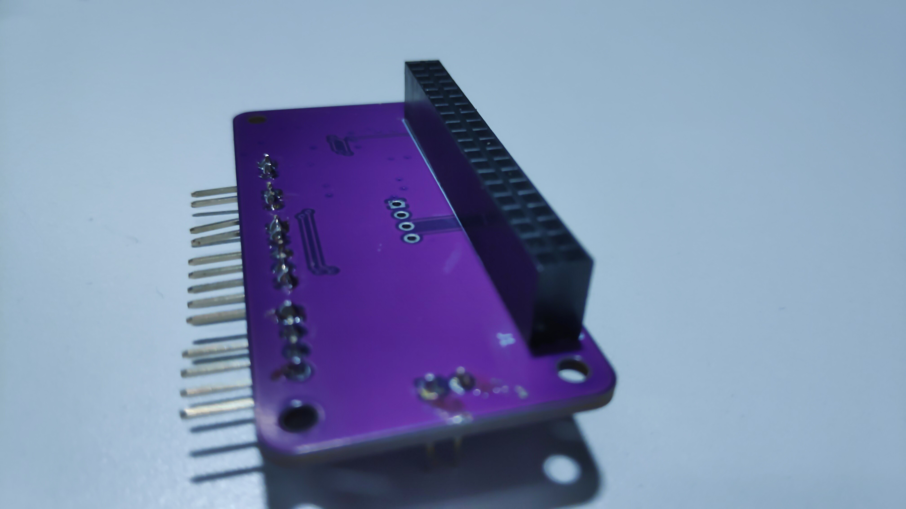

Gewinkelte Stiftleisten anlöten.

Aus Gründen für die 5V Spannungsversorgung gerade Stiftleisten verwenden.

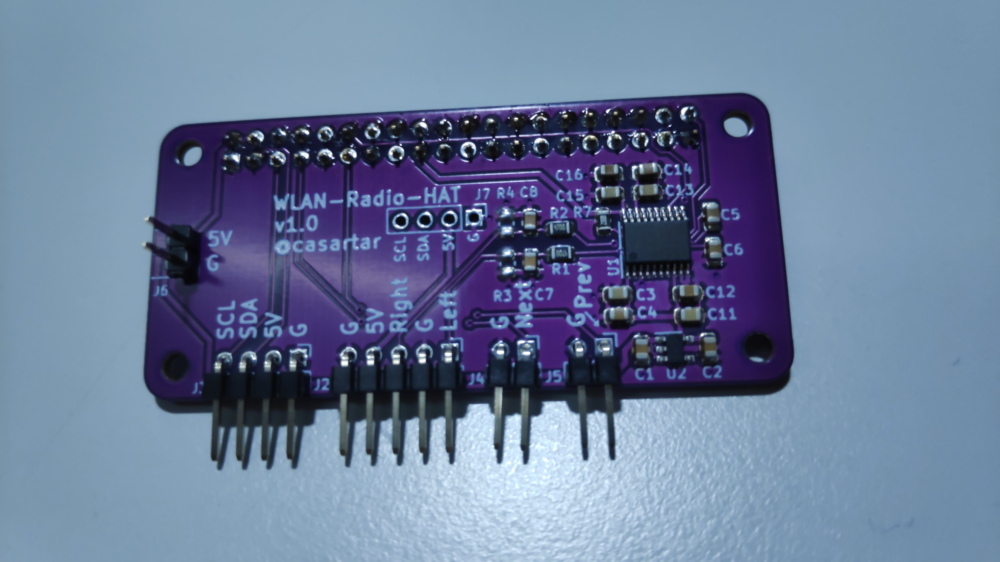

Buchsenleiste and LCD anlöten.

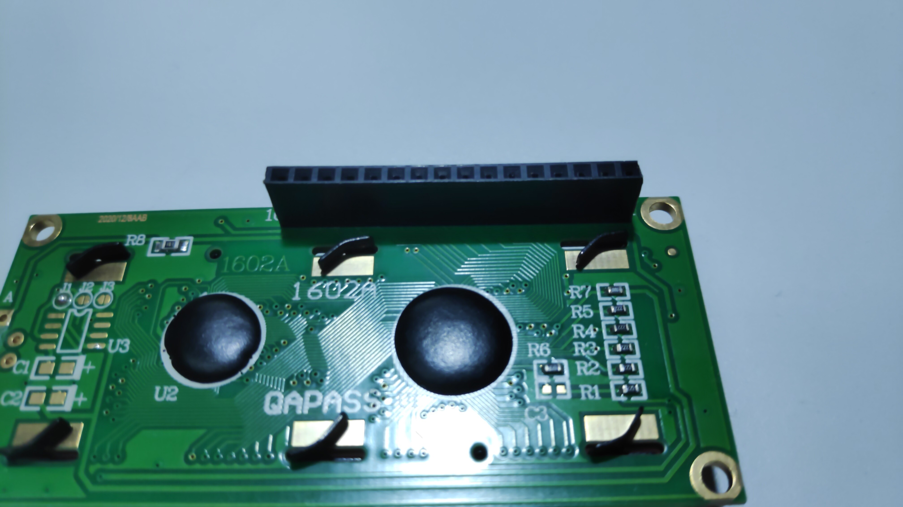

Gewinkelte Stifleisten an Verstärkermodul anlöten.

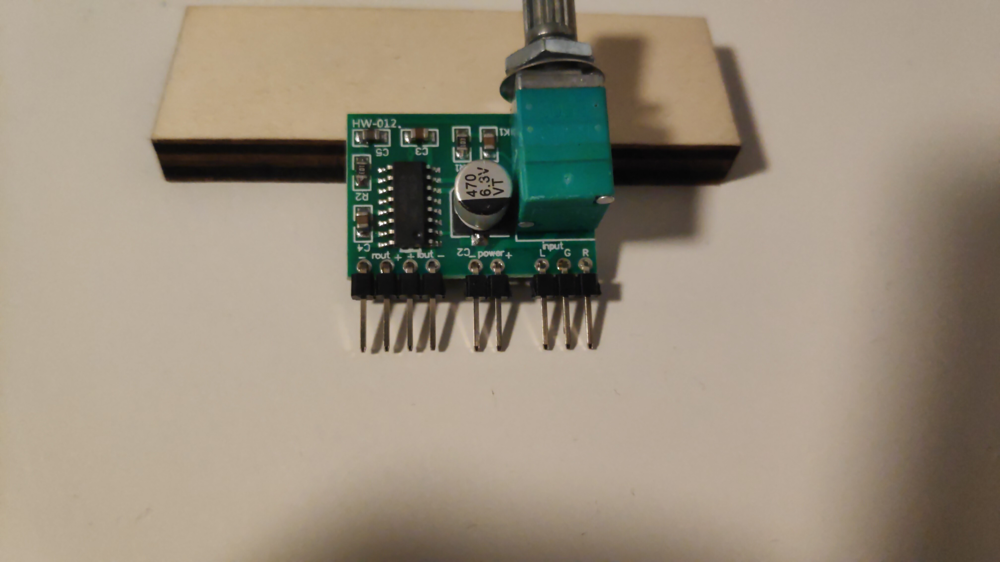


### Testaufbau

* WLAN-Radio-HAT auf Raspberry Pi Zero W stecken.
* LCD anschließen.
* Verstärker anschließen.
* Lautsprecher an Verstärker anstecken.
* Micro-USB-Kabel an das Raspberry Pi anschließen (PWR IN).

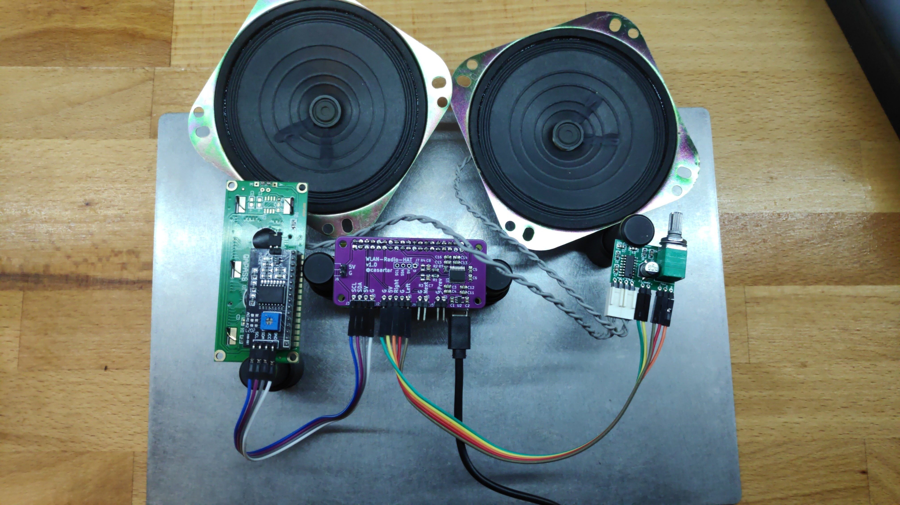

## Software-Installation

### Erstellen der SD-Karte für den Raspberry Pi mittels Raspberry Pi Imager

Raspberry Pi Imager installieren - https://www.raspberrypi.com/software/ 

Raspberry Pi Imager ausführen.
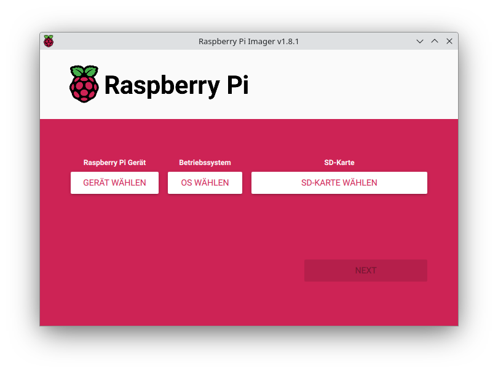
Gerät wählen: Raspberry Pi Zero
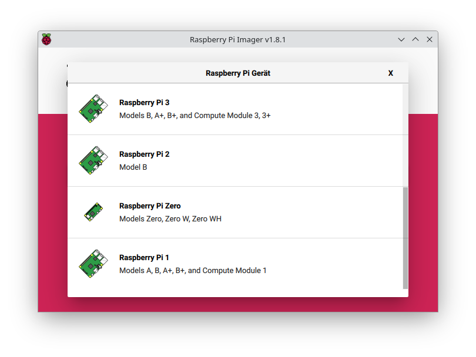
Os wählen: Raspberry Pi OS (other)
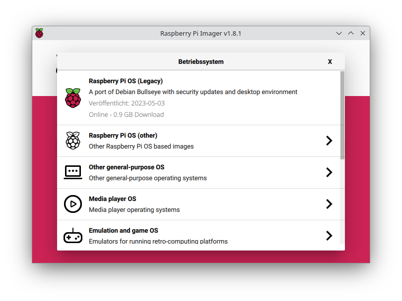
Raspberry Pi OS (Legacy) Lite
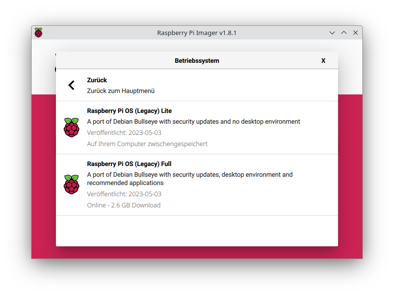
SD-Karte wählen.
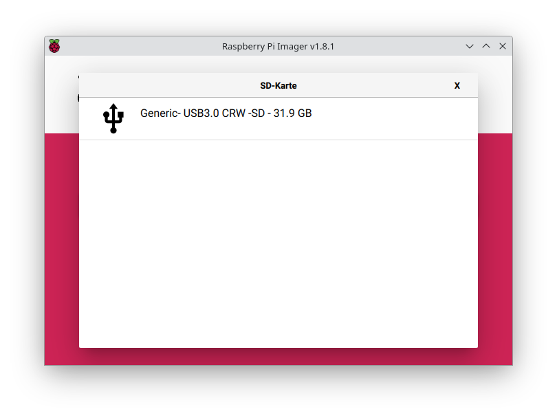
Next
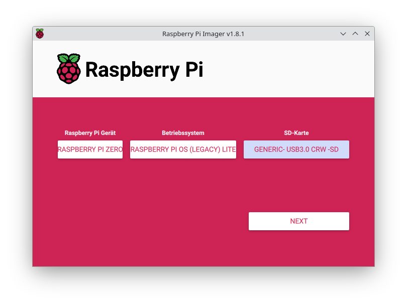
Einstellungen bearbeiten.
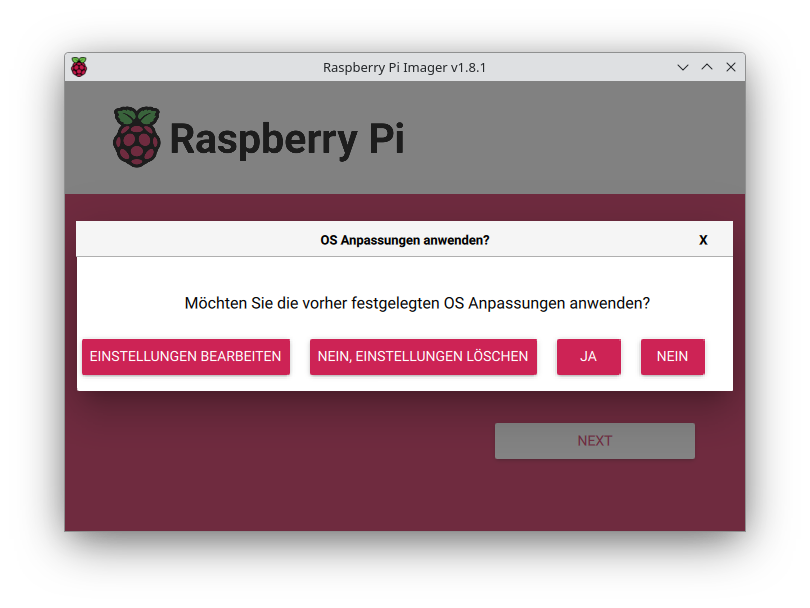
* Hostname: individuell benennen.
* Benutzer: "pi"
* Passwort: "raspberry"
* SSID: geheim
* Passwort: geheim

Im Reiter "Dienste" kann man auch gerne seinen Public Key hinterlegen, muss aber nicht sein.
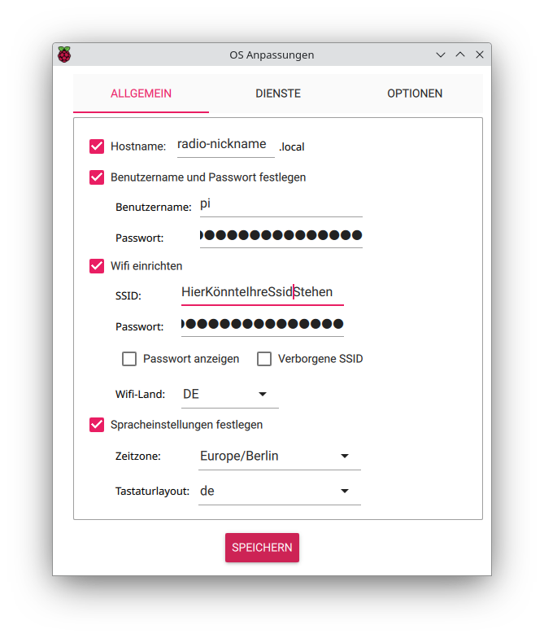
Speichern und Ja wählen und mit Ja bestätigen
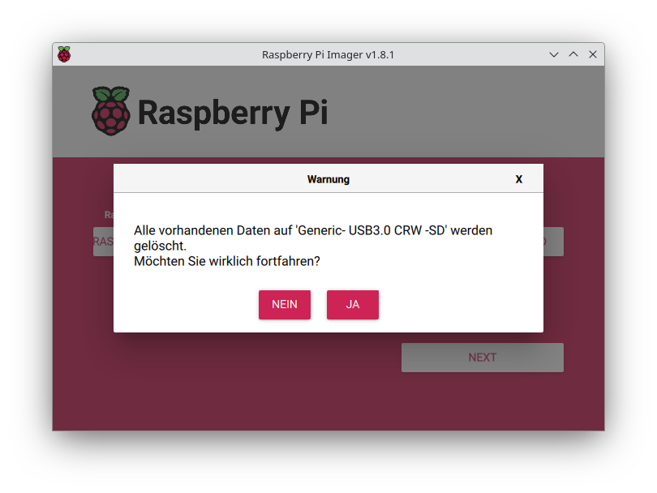
SD-Karte wird beschrieben.
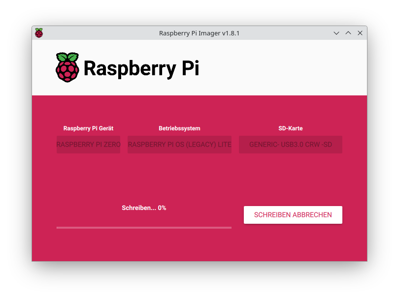
SD-Karte ist fertig beschrieben.
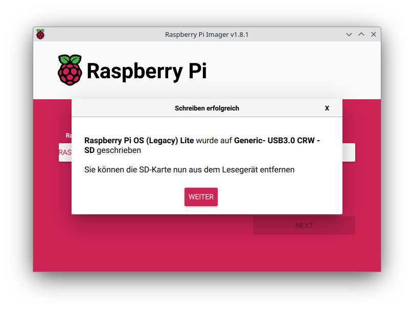

SD-Karte in Pi einstecken und Micro-USB-Kabel an Laptop anschließen.
  
### Der erste Start des Pi dauert u.U. mehrere Minuten

### System aktualisieren
IP Adresse herausfinden

Verbinden per ssh, user: pi; passwort wie oben konfiguriert.
Der Befehl funktioniert unter Linux und unter Window in der PowerShell

```
ssh pi@xxx.xxx.xxx.xxx

sudo apt update
sudo apt upgrade
```

### GIT installieren und WLAN-Radio2.0 clonen

```
sudo apt install git
sudo git clone https://github.com/casartar/WLAN-Radio2.0.git
```

### LCD Komponenten installieren und Testen

```
sudo apt install i2c-tools
sudo apt install python3-pip
pip install RPLCD
```
Wenn pip einen Fehler ausgibt noch mal versuchen mit:
```
pip install RPLCD --break-system-packages
```

/boot/config.txt anpassen mit

```
sudo nano /boot/config.txt
```

Parameter: **dtparam=i2c_arm=on** einkommentieren

Speichern mit Strg+O und Schließen mit Strg+X und Enter.

Neustart

```
sudo reboot
```

Verbinden per ssh

```
cd ~/WLAN-Radio2.0/Software
python3 lcd_test.py
```

Auf dem LCD sollte jetzt **"WLAN Radio"** und **"1234567890abcdef"** angezeigt werden.

### Audio Komponenten installieren und Testen

/boot/config.txt anpassen mit

```
sudo nano /boot/config.txt
```

Am Ende der Datei hinzufügen: **dtoverlay=hifiberry-dac**
Zeile auskommentieren (Raute vorne dran) **#dtparam=audio=on**
Zeile auskommentieren (Raute vorne dran)  **#dtoverlay=vc4-kms-v3d**

Speichern mit Strg+O und Schließen mit Strg+X und Enter.

Neustart

```
sudo reboot
```

Verbinden per ssh

Testen mit:

```
speaker-test -t wav -c 2
```

Es sollte "Front Left" und "Front Right" aus den entsprechenden Lautsprechern ertönen.

### MPD und MPC einrichten (Music Player Daemon, Music Player Client)

```
sudo apt install mpd
sudo apt install mpc
```

/etc/mpd.conf anpassen mit

```
sudo nano /etc/mpd.conf
```

Zeile ändern von
```
playlist_directory   /var/lib/mpd/playlists
```
in
```
playlist_directory   /home/pi/Playlists/
```

und 

```
audio_output {
#       type            "alsa"
#       name            "My ALSA Device"
#       device          "hw:0,0"        # optional
#       mixer_type      "hardware"      # optional
#       mixer_device    "default"       # optional
#       mixer_control   "PCM"           # optional
#       mixer_index     "0"             # optional
}
```
ändern in 

```
audio_output { 
        type            "alsa" 
        name            "sysdefault:CARD=sndrpihifiberry" 
        mixer_type      "software" 
}
```

Speichern mit Strg+O und Schließen mit Strg+X und Enter.

Das Verzeichnis anlegen: 
```
mkdir ~/Playlists
```

Default Playlist aus dem Repo in dieses Verzeichnis kopieren: 

```
cp ~/WLAN-Radio2.0/Playlist/Playlist.m3u Playlists/
```

mpd.service neu starten: 
```
sudo systemctl restart mpd
```
Testen ob Radio abgespielt wird
```
mpc load Playlist
mpc play
mpc next
mpc status
```
Wenn nach mpc load P Playlist nicht autovervollständigt wird, muss evtl. in der mpd.conf der User von mpd zu pi geändert werden.

MPD Library installieren
```
sudo apt install python3-mpd
```
MPD Test Script ausführen
```
cd ~/WLAN-Radio2.0/Software
python3 mpd_test.py
```

### Radio Testen

```
cd ~/WLAN-Radio2.0/Software
python3 radio_test.py
```

Mit der Pinzette die beiden Pins für Next respektive Previous kurzschließen und prüfen, ob ein anderer Sender abgespielt wird.

### Weitere WLAN-Zugangsdaten hinzufügen

```
sudo nano /etc/wpa_suppicant/wpa_supplicant.conf
```
Die konfiguration sollte in etwa so aussehen:

```
ctrl_interface=DIR=/var/run/wpa_supplicant GROUP=netdev
update_config=1

network={
        ssid="HierKönnteIhreSsidStehen"
        psk=e04000a6ccb88f7ac28bd18ed807fdb820ac8524dbc6f50d4bfe2d788c3609fd
}
```

Das muss erweitert werden zu:

```
ctrl_interface=DIR=/var/run/wpa_supplicant GROUP=netdev
update_config=1

network={
        ssid="HierKönnteIhreSsidStehen"
        psk=e04000a6ccb88f7ac28bd18ed807fdb820ac8524dbc6f50d4bfe2d788c3609fd
}
network={
        ssid="AndereSsid"
        psk="pazzzW0rd"
}
```

Speichern mit Strg+O und Schließen mit Strg+X und Enter.

### Autostart

```
sudo cp ~/WLAN-Radio2.0/Config/wlan-radio.service /etc/systemd/system/
sudo chmod 640 /etc/systemd/system/wlan-radio.service
systemctl status htg.service
sudo systemctl daemon-reload
sudo systemctl enable wlan-radio
sudo systemctl start wlan-radio
sudo systemctl status wlan-radio
```


